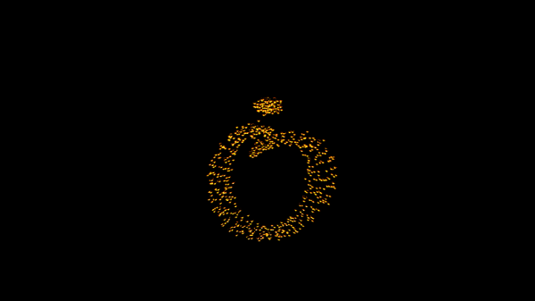

# Zero-with-Dot Animation
Author: Oleg Żero (https://zerowithdot.com)



Since you are looking at this repository, I trust you would like to use this code as a starting point for your own animation.
By all means! Feel free to do whatever you want with it, but I would appreciate if you give me some feedback or put a reference in your blog or wherever is that you use it. Thanks.

To see it live, go: [zerowithdot.com](https://zerowithdot.com).

## Getting started
The description below explains the necessary steps you need to take to adapt this code to your needs.

This animation has been crafted using:
* [Blender 2.80](https://www.blender.org/) software for creating of 3D graphics,
* [three.js](https://threejs.org) library for handling it in the web browser,
* [webpack](https://webpack.js.org) for structuring of the projects, 
* [babel](https://babeljs.io/) for transpiling of this code to be executable by older browsers, and 
* [eslint](https://eslint.org/) to make it more... 'hygenic'.

In addition to that I used [dat.gui](https://github.com/dataarts/dat.gui) during the development.

## Basic idea
The basic idea behind this animation is very simple:
1. Create a new 3D binary file using e.g. Blender and export it as .glb file.
Mine is called `ozero-smooth.glb` and it is available in `./src/models/`.
2. Load it in using three.js as object and define invisible 3D points that correspond to every node of the original 3D object (or objects if you have several disjont solids).
3. For every invisible 'anchor' point define a sphere (or cube, or whatever...) and initialize its distance from the anchor with some random number.
4. Make it all rotate, float, move...
5. Register two events for entering and exiting of the canvas which increase or reduce this distance.

That is it!

If your 3D object will have a different geometry, the dots will assemble in a shape of this object.
Just remember to **watch out** for not overloading the scene with too many of them or defining too many light sources as somebody's GPU may me too slow to render it smoothly.

## Including the code
The `./src/index.html` file only provides the necessary minimum for the development of the scene.
It basically creates a canvas element and allows the thing to render.

To start the development, execute:
```
./node-modules/.bin/webpack-dev-server
```
Then open the browser and type `localhost:8000`.

Once you are done with the development, do the following steps:
1. Execute `./node_modules/.bin/webpack` to build the project.
2. Go to `./dist/` and copy the `app.bundle.js` file into some other project you might have.
3. In the new project, you need to insert the following lines into an html document, where you want the animation to render.

```
<!-- somewhere in body -->
<div id='threeCanvas'></div>


<!-- at the end of the page -->
<script src='assets/app.bundle.js`></script>
```

This is it. Have fun.

